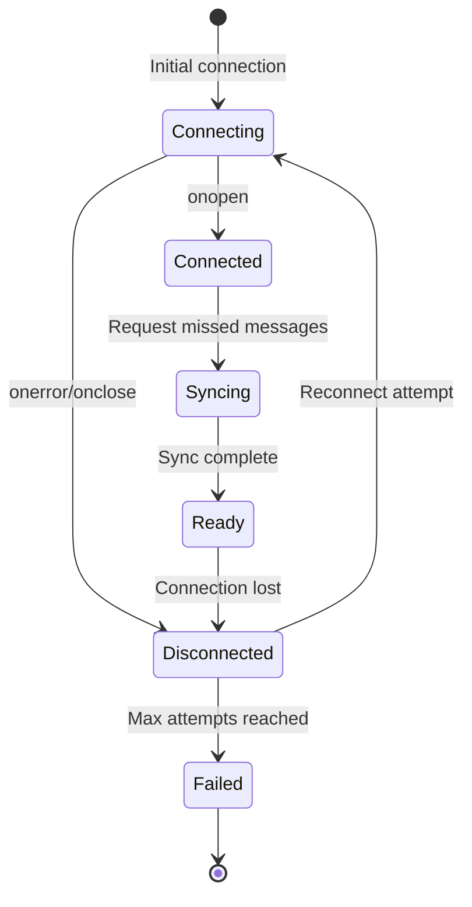

# WebSocket Reconnection and Message Queuing Strategy

## Overview

This document describes the WebSocket reconnection strategy and message queuing implementation for the P2P Marketplace chat system. The implementation ensures reliable real-time communication between buyers and sellers even in the presence of network instability.

## Architecture

### Components

1. **Backend WebSocket Server** (`api/routers/chat.py`)
   - Manages WebSocket connections per deal
   - Stores all messages in PostgreSQL database
   - Provides message synchronization on reconnection
   - Handles typing indicators and read receipts

2. **Frontend WebSocket Client** (`frontend/src/pages/ChatPage.tsx`)
   - Manages WebSocket connection lifecycle
   - Implements exponential backoff reconnection
   - Queues messages during disconnection
   - Requests missed messages on reconnection

## Reconnection Strategy

### Exponential Backoff Algorithm

When a WebSocket connection is lost, the client automatically attempts to reconnect using exponential backoff:

```
Attempt 1: Wait 1 second   (2^0 * 1000ms)
Attempt 2: Wait 2 seconds  (2^1 * 1000ms)
Attempt 3: Wait 4 seconds  (2^2 * 1000ms)
Attempt 4: Wait 8 seconds  (2^3 * 1000ms)
Attempt 5: Wait 16 seconds (2^4 * 1000ms)
Maximum:   Wait 30 seconds (capped)
```

**Configuration:**
- Maximum reconnection attempts: 5
- Base delay: 1000ms
- Maximum delay: 30000ms (30 seconds)
- Backoff formula: `Math.min(1000 * Math.pow(2, attemptNumber), 30000)`

### Connection Lifecycle



## Message Queuing

### Client-Side Queue

When the WebSocket connection is lost, messages are queued locally:

```typescript
const [messageQueue, setMessageQueue] = useState<string[]>([])

// Queue message if disconnected
if (!isConnected) {
  setMessageQueue(prev => [...prev, message])
  showToast('Message queued, will send when reconnected', 'info')
}
```

**Queue Behavior:**
- Messages are stored in memory (React state)
- Queue persists during reconnection attempts
- Queue is cleared when messages are successfully sent
- Queue is lost if user closes the page (intentional - prevents stale messages)

### Message Synchronization

On reconnection, the client requests missed messages from the server:

#### 1. Connection Established

Server sends connection confirmation with last message ID:

```json
{
  "type": "connected",
  "deal_id": 123,
  "user_id": 456,
  "last_message_id": 789,
  "timestamp": "2024-01-15T12:00:00Z"
}
```

#### 2. Client Requests Missed Messages

If client's `lastMessageId` is less than server's `last_message_id`:

```json
{
  "type": "get_missed_messages",
  "last_message_id": 750
}
```

#### 3. Server Sends Missed Messages

Server queries database for messages with `id > last_message_id`:

```sql
SELECT * FROM deal_messages 
WHERE deal_id = ? AND id > ? 
ORDER BY created_at ASC
```

Each missed message is sent individually:

```json
{
  "type": "message",
  "message_id": 751,
  "deal_id": 123,
  "sender_id": 456,
  "message_text": "Hello",
  "is_read": false,
  "created_at": "2024-01-15T11:55:00Z"
}
```

#### 4. Sync Complete

Server notifies client when all missed messages have been sent:

```json
{
  "type": "sync_complete",
  "count": 5
}
```

#### 5. Send Queued Messages

Client sends all queued messages after sync completes:

```typescript
if (messageQueue.length > 0) {
  messageQueue.forEach(msg => {
    websocket.send(msg)
  })
  setMessageQueue([])
}
```

## Message Types

### Client → Server

| Type | Description | Payload |
|------|-------------|---------|
| `text` | Send text message | `{ type: "text", content: "message" }` |
| `typing` | Typing indicator | `{ type: "typing" }` |
| `read` | Mark message as read | `{ type: "read" }` |
| `read_all` | Mark all messages as read | `{ type: "read_all" }` |
| `ping` | Heartbeat | `{ type: "ping" }` |
| `get_missed_messages` | Request missed messages | `{ type: "get_missed_messages", last_message_id: 123 }` |

### Server → Client

| Type | Description | Payload |
|------|-------------|---------|
| `connected` | Connection confirmation | `{ type: "connected", deal_id, user_id, last_message_id, timestamp }` |
| `message` | New message | `{ type: "message", message_id, sender_id, message_text, is_read, created_at }` |
| `typing` | Typing indicator | `{ type: "typing", user_id, is_typing }` |
| `read_receipt` | Message read confirmation | `{ type: "read_receipt", message_id, read_by, read_at }` |
| `read_all_receipt` | All messages read | `{ type: "read_all_receipt", read_by, count, read_at }` |
| `pong` | Heartbeat response | `{ type: "pong" }` |
| `sync_complete` | Sync finished | `{ type: "sync_complete", count }` |

## Heartbeat Mechanism

To keep connections alive and detect disconnections quickly:

**Server-Side:**
- Backend sends `ping` every 30 seconds (configurable)
- Implemented in FastAPI WebSocket handler

**Client-Side:**
- Client responds with `pong` when receiving `ping`
- Client can also send `ping` to check connection health

```typescript
// Server sends ping every 30 seconds
setInterval(() => {
  if (ws.readyState === WebSocket.OPEN) {
    ws.send(JSON.stringify({ type: 'ping' }))
  }
}, 30000)

// Client responds to ping
if (data.type === 'ping') {
  ws.send(JSON.stringify({ type: 'pong' }))
}
```

## Error Handling

### Connection Errors

```typescript
websocket.onerror = (error) => {
  console.error('WebSocket error:', error)
  setIsConnected(false)
}
```

### Reconnection Failure

After maximum reconnection attempts:

```typescript
if (reconnectAttempts >= maxReconnectAttempts) {
  showToast('Connection lost. Please refresh the page.', 'error')
}
```

### Message Send Failure

If message fails to send while connected:

```typescript
try {
  ws.send(message)
} catch (error) {
  // Queue message for retry
  setMessageQueue(prev => [...prev, message])
}
```

## UI Indicators

### Connection Status

```typescript
{!isConnected && (
  <div className="text-xs text-red-500">Reconnecting...</div>
)}
```

### Syncing Status

```typescript
{isSyncing && (
  <div className="text-xs text-blue-500">Syncing messages...</div>
)}
```

### Queued Messages

```typescript
{messageQueue.length > 0 && (
  <div className="text-xs text-yellow-600">
    {messageQueue.length} message(s) queued
  </div>
)}
```

### Message Read Status

```typescript
{isOwn && (
  <span>{msg.is_read ? '✓✓' : '✓'}</span>
)}
```

## Performance Considerations

### Database Queries

Missed message queries are optimized with indexes:

```sql
CREATE INDEX idx_deal_messages_deal_id_id 
ON deal_messages(deal_id, id);

CREATE INDEX idx_deal_messages_created_at 
ON deal_messages(created_at);
```

### Message Limits

- Maximum 50 messages fetched on initial load
- Missed messages fetched without limit (assumes reasonable disconnection duration)
- Consider pagination for very long disconnections

### Memory Management

- Message queue stored in React state (memory)
- Queue cleared after successful send
- No persistent storage to avoid stale messages

## Testing Scenarios

### 1. Normal Reconnection

1. User opens chat
2. Network disconnects
3. User sends message → queued
4. Network reconnects
5. Client syncs missed messages
6. Client sends queued message
7. ✓ All messages delivered

### 2. Multiple Reconnection Attempts

1. Network unstable
2. Connection drops repeatedly
3. Exponential backoff prevents server overload
4. Eventually connects
5. ✓ Messages synchronized

### 3. Max Attempts Reached

1. Network completely down
2. 5 reconnection attempts fail
3. User sees error message
4. ✓ Graceful failure

### 4. Message Deduplication

1. Message sent
2. Connection drops before confirmation
3. Reconnect and sync
4. ✓ No duplicate messages (checked by message ID)

## Configuration

### Backend (`api/routers/chat.py`)

```python
# Heartbeat interval (seconds)
HEARTBEAT_INTERVAL = 30

# Message query limit
MAX_MISSED_MESSAGES = 1000  # Safety limit
```

### Frontend (`frontend/src/pages/ChatPage.tsx`)

```typescript
// Reconnection settings
const maxReconnectAttempts = 5
const baseDelay = 1000  // 1 second
const maxDelay = 30000  // 30 seconds

// WebSocket URL
const WS_URL = import.meta.env.VITE_WS_URL || 'ws://localhost:8000/api/v1'
```

## Security Considerations

1. **Authentication**: Token passed in WebSocket URL query parameter
2. **Authorization**: Server verifies user is participant in deal
3. **Message Validation**: All messages validated before storage
4. **Rate Limiting**: Consider implementing rate limits for reconnection attempts
5. **Message Integrity**: Messages stored in database, not just in-memory

## Future Enhancements

1. **Persistent Queue**: Store queued messages in localStorage for page refresh survival
2. **Compression**: Compress message payloads for large message batches
3. **Binary Protocol**: Use binary WebSocket frames for efficiency
4. **Message Pagination**: Paginate missed messages for very long disconnections
5. **Offline Mode**: Full offline support with service workers
6. **Push Notifications**: Notify users of new messages when app is closed

## Troubleshooting

### Connection Won't Establish

- Check WebSocket URL configuration
- Verify token is valid
- Check CORS settings
- Verify user has access to deal

### Messages Not Syncing

- Check `lastMessageId` is being tracked correctly
- Verify database query returns correct messages
- Check for message ID gaps

### Reconnection Loop

- Check network stability
- Verify server is not rejecting connections
- Check for authentication issues

### Queued Messages Not Sending

- Verify `sync_complete` event is received
- Check WebSocket state is OPEN
- Verify message format is correct

## References

- [WebSocket API (MDN)](https://developer.mozilla.org/en-US/docs/Web/API/WebSocket)
- [FastAPI WebSockets](https://fastapi.tiangolo.com/advanced/websockets/)
- [Exponential Backoff Algorithm](https://en.wikipedia.org/wiki/Exponential_backoff)
- Requirements: 9.7, 9.8, 25.1, 25.2, 25.3, 25.4
